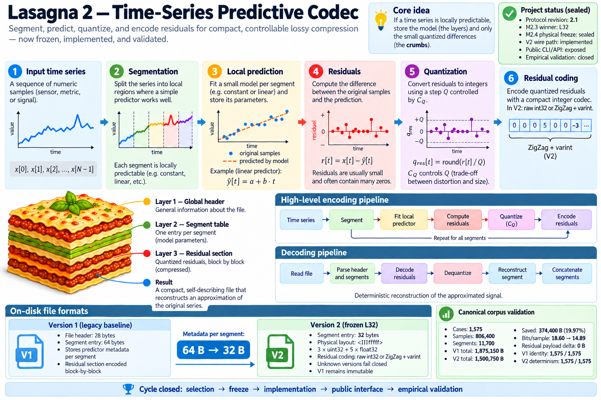

# Lasagna 2 — Time Series Predictive Codec

[](https://github.com/gcomneno/lasagna-v2/actions/workflows/ci.yml)
[](https://github.com/gcomneno/lasagna-v2/actions/workflows/security.yml)
[](https://github.com/gcomneno/lasagna-v2/actions/workflows/supply-chain.yml)
[](LICENSE)

**Segment → predict → quantize → encode residuals.**



Lasagna 2 is an experimental predictive codec for structured, univariate time
series.

Instead of treating a signal as an opaque byte stream, it divides the series
into locally predictable segments, fits a small predictor to each segment, and
stores quantized prediction errors together with compact model metadata.

The project is primarily a **rate-distortion and representation experiment**.
It is not presented as a universal replacement for general-purpose
compressors.

> **Research status:** experimental, reproducible, and intentionally explicit
> about its assumptions and limitations.

For deployment-oriented guidance, start with
[`docs/production-operations.md`](docs/production-operations.md). It collects
the supported operational surface, failure/security boundaries, resource and
performance expectations, migration guidance, and links to the authoritative
contracts. Lasagna remains experimental until the production-readiness tracker
passes every mandatory gate.

---

## Measured V2 result

The current V2 physical layout was selected under a frozen protocol and then
validated end-to-end on the canonical synthetic corpus.

| Metric | V1 | V2 |
|---|---:|---:|
| Segment metadata | 64 B | 32 B |
| Canonical corpus size | 1,875,150 B | 1,500,750 B |
| Bits/sample | 18.6027 | 14.8884 |
| Residual payload | 806,400 B | 806,400 B |

Observed result:

```text
Cases                         1,575
Samples                     806,400
Segments                     11,700

Bytes saved                 374,400
Corpus reduction             19.9664%
Bits/sample saved             3.7143

Residual payload delta             0 B
Non-metadata wire delta            0 B

V1 reference identity       1575/1575
V2 determinism              1575/1575
```

The full observed saving is exactly accounted for by the segment metadata
change:

```text
11,700 segments × (64 B - 32 B)
= 374,400 B
```

The aggregate distortion remained effectively unchanged at corpus scale.

See the complete measurements, predictor-level breakdown, provenance, and
distortion analysis in
[`docs/v2-empirical-validation.md`](docs/v2-empirical-validation.md).

### What this result does — and does not — claim

It shows that, **on the frozen canonical corpus**, the selected V2 metadata
layout reduces the physical Lasagna wire size by 19.97% relative to V1 without
moving that cost into a larger residual payload.

It does **not** establish that Lasagna is universally smaller than gzip, zstd,
or other general-purpose or domain-specific codecs.

The canonical corpus is synthetic and protocol-controlled. Results on other
signals depend on signal structure, segmentation, predictor behavior,
quantization, and residual statistics.

---

## Core idea

If a time series is locally predictable, storing the model plus a small error
can be more useful than repeatedly storing the original values.


The three principal layers of an `.lsg2` stream are:

1. **Global header and context**
2. **Segment table with predictor metadata**
3. **Residual section encoded block-by-block**

The guiding design principle is:

> **Model structure only when structure pays for itself.**

---

## Predictors and segmentation

Lasagna currently supports univariate `TimeSeries` data with:

- sample values;
- sampling interval `dt`;
- start time `t0`;
- symbolic unit.

Segmentation modes:

- `fixed` — constant segment length;
- `adaptive` — segment growth controlled by model error.

Per-segment predictors:

- `mean`;
- `linear`;
- `rw` — random walk;
- `auto` — model selection per segment.

Residual coding currently exposed by the public wire path:

- raw signed int32;
- ZigZag + varint.

Zero-run residual coding has been explored as a research candidate, but it is
**not part of the currently implemented public V2 wire path**.

---

## V1 and V2 wire formats

Lasagna keeps V1 readable and reproducible while using V2 as the current
default wire format.

### V1 — compatibility baseline

V1 stores a 64-byte segment entry:

```text
<6Iddddd>
```

V1 is retained as the legacy compatibility format. New encodes use V2 by
default; use the explicit V1 API or CLI format selector when byte-compatible
legacy output is required.

### V2 — frozen L32 layout

V2 stores a 32-byte segment entry:

```text
<IIIfffff>
```

Fields:

```text
start_idx       uint32
end_idx         uint32
predictor_type  uint32

mean            float32
slope           float32
intercept       float32
quant_step_Q    float32
seed_value      float32
```

The V2 layout was not chosen by intuition alone. Candidate layouts were
evaluated under a frozen protocol, L32 was selected, and the physical layout
was then sealed before the public encoder/decoder path was implemented.

Unknown wire versions fail closed.

---

## CLI

Install the project in a virtual environment:

```bash
git clone https://github.com/gcomneno/lasagna-v2.git
cd lasagna-v2

python3 -m venv .venv
source .venv/bin/activate

python -m pip install --upgrade pip
python -m pip install -e ".[dev]"
```

### Encode using the V2 default

```bash
lasagna2 encode \
  data/examples/trend.csv \
  /tmp/trend-v2.lsg2 \
  --dt 1 \
  --t0 1970-01-01T00:00:00Z \
  --unit arbitrary \
  --predictor linear
```

Equivalent explicit form:

```bash
lasagna2 encode \
  data/examples/trend.csv \
  /tmp/trend-v2.lsg2 \
  --dt 1 \
  --t0 1970-01-01T00:00:00Z \
  --unit arbitrary \
  --predictor linear \
  --format-version 2
```

### Encode legacy V1 explicitly

```bash
lasagna2 encode \
  data/examples/trend.csv \
  /tmp/trend-v1.lsg2 \
  --dt 1 \
  --t0 1970-01-01T00:00:00Z \
  --unit arbitrary \
  --predictor linear \
  --format-version 1
```

### Decode

The decoder auto-detects V1 and V2:

```bash
lasagna2 decode \
  /tmp/trend-v2.lsg2 \
  /tmp/trend-decoded.csv
```

### Inspect

`info` also auto-detects the wire version:

```bash
lasagna2 info /tmp/trend-v2.lsg2 -v
```

---

## Migrating from v0.2.2 to v0.3.0

v0.3.0 intentionally changes the implicit encoding default from V1 to V2:

```text
v0.2.2:
encode_timeseries() -> V1
lasagna2 encode      -> V1

v0.3.0:
encode_timeseries() -> V2
lasagna2 encode      -> V2
```

Decoding remains backward-compatible: `decode_timeseries()` and the CLI decoder
continue to auto-detect and decode both V1 and V2 files.

If existing code depends on byte-compatible V1 output, make the legacy format
explicit instead of relying on the default.

Python:

```python
from lasagna2 import encode_timeseries_v1

encoded_v1 = encode_timeseries_v1(ts)
```

CLI:

```bash
lasagna2 encode input.csv output.lsg2 \
  --dt 1 \
  --t0 1970-01-01T00:00:00Z \
  --unit arbitrary \
  --format-version 1
```

V1 remains a supported compatibility format. This migration does not establish
a removal schedule for V1.

---

## Python API

`encode_timeseries()` uses V2 by default:

```python
from lasagna2 import TimeSeries, decode_timeseries, encode_timeseries

ts = TimeSeries(
    values=[0.1 * i for i in range(200)],
    dt=1.0,
    t0="1970-01-01T00:00:00Z",
    unit="arbitrary",
)

encoded_v2 = encode_timeseries(
    ts,
    predictor="linear",
)

decoded = decode_timeseries(encoded_v2)
```

Explicit V2 encoding remains available through `encode_timeseries_v2()`.

Legacy V1 output is available explicitly when byte-compatible V1 encoding is
required:

```python
from lasagna2 import TimeSeries, decode_timeseries, encode_timeseries_v1

ts = TimeSeries(
    values=[0.1 * i for i in range(200)],
    dt=1.0,
    t0="1970-01-01T00:00:00Z",
    unit="arbitrary",
)

encoded_v1 = encode_timeseries_v1(
    ts,
    predictor="linear",
)

decoded = decode_timeseries(encoded_v1)
```

`decode_timeseries()` accepts both supported wire versions.

---

## Evidence-first development

The V2 physical format followed a deliberately staged validation cycle:

```text
candidate study
    ↓
frozen evaluation protocol
    ↓
canonical corpus
    ↓
candidate evaluation
    ↓
L32 selection
    ↓
physical freeze
    ↓
wire implementation
    ↓
public API / CLI
    ↓
empirical validation
```

Current state:

```text
Protocol revision             2.1
M2.3 winner                   L32
M2.3 selection                CLOSED
M2.4 physical layout          <IIIfffff>
M2.4 segment entry            32 bytes
M2.4 freeze                   SEALED

V2 wire encoder               implemented
V2 wire decoder               implemented
Public V2 API                 exposed
Public V2 CLI                 exposed
Empirical validation          PASS
```

The implementation does not retroactively rewrite the experiment that selected
the layout.

---

## Reproducibility and evidence

Key documents:

- [`docs/rate-distortion-design.md`](docs/rate-distortion-design.md) —
  frozen experimental method and revision history;
- [`docs/m2-3-evidence.md`](docs/m2-3-evidence.md) —
  candidate evaluation evidence;
- [`docs/v2-empirical-validation.md`](docs/v2-empirical-validation.md) —
  end-to-end V1 vs V2 corpus validation;
- [`docs/manifesto.md`](docs/manifesto.md) —
  original conceptual motivation.

The empirical-validation document records the canonical identities used for
the final V1/V2 comparison.

---

## Testing and safety

The current test suite covers:

- core encode/decode behavior;
- V1 compatibility;
- V2 wire round-trips;
- physical L32 byte layout;
- CLI V1/V2 encode/decode/info;
- unsupported-version fail-closed behavior;
- malformed or hostile inputs.

The repository also contains GitHub Actions workflows for:

- CI;
- CodeQL and dependency review;
- pip audit;
- OpenSSF Scorecard;
- hardened runners.

The repository maintains automated codec, compatibility, security and
documentation regression coverage. Current test counts are intentionally not
hard-coded here; the test suite is the authoritative executable evidence.

---

## Limitations

Lasagna 2 is research software.

Current boundaries include:

- univariate time series only;
- whole-file processing as the current baseline;
- lossy reconstruction when quantization is active;
- synthetic and externally sourced qualification corpora, without a claim that
  they represent every workload;
- no claim of universal compression superiority;
- V1/V2 wire and public API/CLI compatibility governed by the published
  stability/deprecation contracts;
- incomplete production qualification for the full numeric domain and
  operational observability;
- not intended as a lossless production archival format.

The V2 result should be interpreted as a controlled comparison against the
project's V1 baseline, not as a benchmark over the full time-series compression
literature.

---

## Project philosophy

A few principles guide the work:

- **Evidence before claims**
- **Freeze methodology before reading the result**
- **A benchmark may eliminate candidates; it must never invent the rule that
  selects them**
- **Model structure only when structure pays for itself**
- **Compatibility changes are explicit**
- **Unknown formats fail closed**

The project started from a "brain-inspired" intuition — segment, predict, keep
the surprise — but the current work is framed as an engineering and
rate-distortion experiment rather than a neuroscience claim.

---

## Contributing

Contributions and technically grounded discussion are welcome.

See [`CONTRIBUTING.md`](CONTRIBUTING.md).

When changing public codec behavior, please include tests and update the
relevant format or evidence documentation.

---

## License

MIT. See [`LICENSE`](LICENSE).
